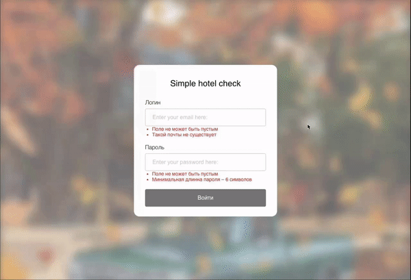
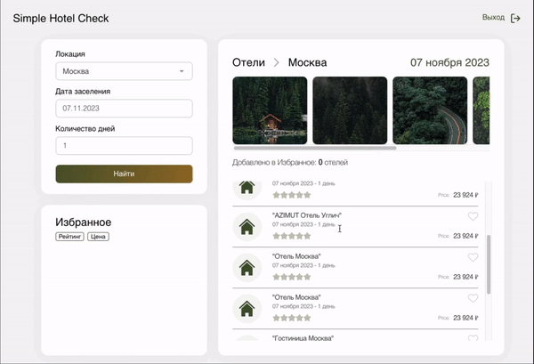
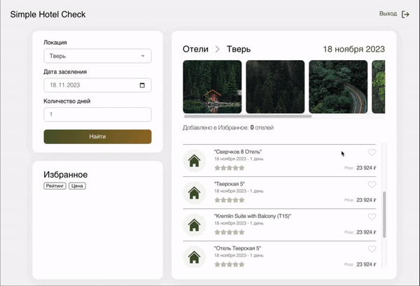

<h1 align="center"> <a href="https://gusap9.github.io/simple-hotels-search/" target="_blank"> React Hotels Search App </a></h1>

## About 
React-Application for hotels searching in Russia.

## Peculiarities
Important points of this app:
- login validation. &#8595;&#8595;&#8595;

 </img>
- date, city and check-in period are changeable. &#8595;&#8595;&#8595;

 </img>
- hotels can be added to favorites. &#8595;&#8595;&#8595;

 </img>

## Usage
To see the project you can directly visit:

<a href="https://gusap9.github.io/simple-hotels-search/" target="_blank"><code style="margin-left:40px">https://gusap9.github.io/simple-hotels-search/</code></a>

To use the app localy:
- clone the todo repo.
- install the dependencies.
- run `npm run start`.
